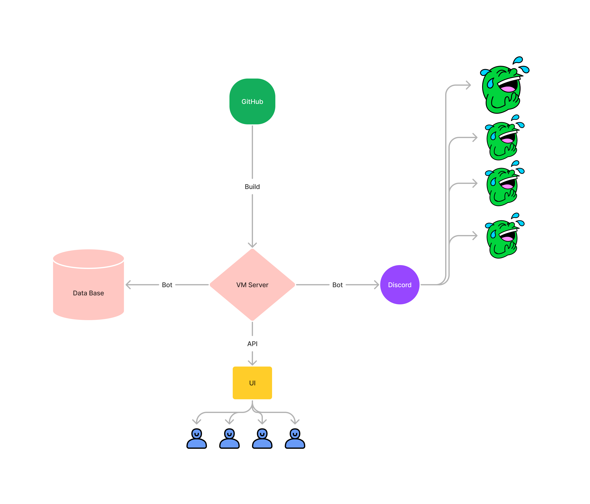

# Investment game 

A game where everyone can feel like an investor, buy and acquire property, and also hold an auction

# Contribution
If you have any suggestions for improving this game, please create a new issue or submit a pull request.

# Social
Pro golang in vk

Golang in YouTube

# License
This project is licensed under the terms of the [license](LICENSE). Please review it before using or distributing the project.
